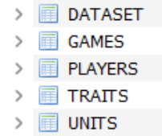

# TFT helper application

***T***eam ***F***ight ***T***actics chatbot helper made made with python and _Riot_ Development API.

Esta aplicacion utiliza tensorflow para crear un modelo de ANN en base a datos recogidos en un sqlite.
Todo el data set necesario para el entrenamiento se genera el solo, cogiendo datos directamente de la API de RIOT.

Para iniciar esta aplicacion solo hace falta correr el main como un script de python.

## Que he querido hacer con esta aplicaion:

    Gracias a la gran cantidad de datos que genera cualquier juego siempre me ha parecido curioso que todo ello por detras solo sean variables muy simples, en este caso yo he cogido algunas de este juego y he empezado a transformalas para que una inteligecia artificial pueda reconocerlas y pueda trabajar sobre ellas. Ahora comentare los pasos que he seguido para crear la aplicacion y como he recogido toda la informacion

## 1. Recogida de informacion:

Esta parte se encarga el archivo ./apiConnection.py, en el tengo las siguientes funciones:
    
    def getUser(name):
Esta se encarga de que yo al pasarle cualquier id(Europea) de un jugador me devuelva datos importantes como el PUUID, el cual es una clave unica que tiene cada jugador y que permite que haga busquedas dentro de la api.
    def getUserByPuuid(PUUID):
A esta le dare uso mas adelanta ya que hace lo contrario a la anterior.
    def getAllMatches(PUUID):
Para conseguir los datos de todas las partidas primero he de buscar su id el cual consiguo aqui, en esta tuve que limitar las partidas por reglas de rate de la api.
    def getMatchById(matchID):
Esta es la funcion mas importante de recogida de informacion, ya que gracias a ella puedo conseguir los json con toda la informacion de la partida.
    def getRank(summID):
Al igual que getUserByPuuid(PUUID) esta la usare mas adelante.

## 2. Almacenaje de la informacion en una base de datos SQLite:
Para no hacer tantas llamadas a la API y no pasarme del limite he construido una base de datos la cual tiene la siguiente forma

    